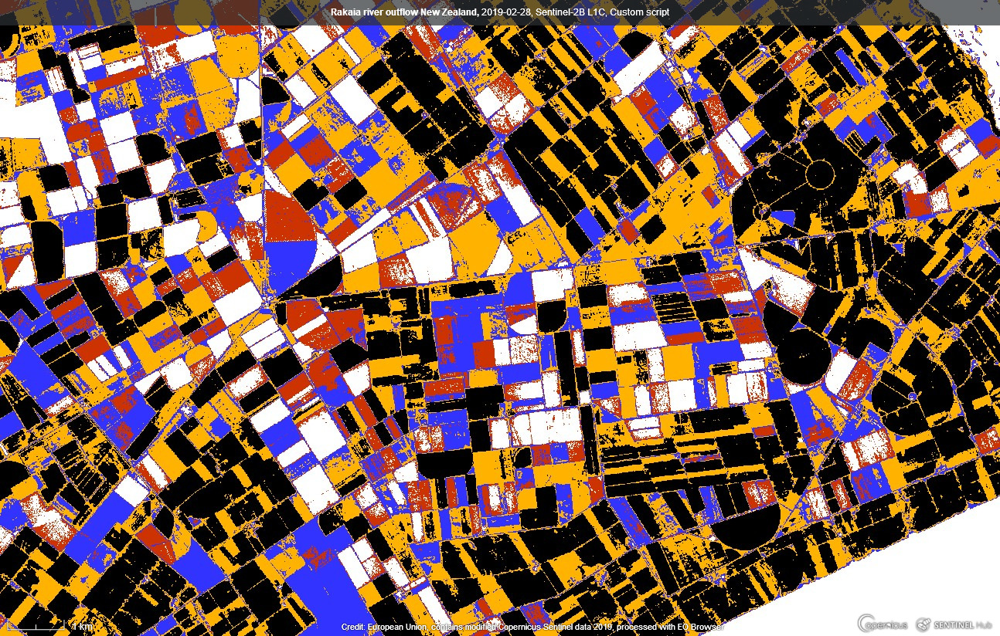

# Homage-to-Mondrian

 | 
--- | ---
Fields in the Netherlands | Piet Mondrian, Composition with Red Blue and Yellow-Green, 1920 [2]

> "To approach the spiritual in art, one will make as little use as possible
 of reality, because reality is opposed to the spiritual."
>
> Piet Mondrian, 1914

Piet Mondrian was a Dutch
painter and theoretician who is regarded as one of the greatest artists of
the 20th century. He is known for being one of the pioneers of 20th century
abstract art, as he changed his artistic direction from figurative painting
to an increasingly abstract style, until he reached a point where his
artistic vocabulary was reduced to simple geometric elements [1].

## General description of the script

This is an artistic script to pay tribute to Dutch painter Piet Mondrian.
It takes normalized difference vegetation index (NDVI) and paints pixels
in 5 different colors depending on its value. Colors are chosen to match
those in the most popular Mondrian's paintings.

The script is universally applicable but the best artistic effects are reached
in locations with repetitive and geometrically uniform landscape, for example in large
agricultural fields. It can be further improved by manually adjusting
limits of NDVI for each color, depending on geographic location and personal taste.

## Evaluate and visualize

Links to locations in EO Browser:

- [Flevoland province in the Netherlands](https://apps.sentinel-hub.com/eo-browser/?lat=52.64765&lng=5.74326&zoom=13&time=2019-10-30&preset=CUSTOM&datasource=Sentinel-2%20L1C&layers=B01,B02,B03&evalscript=dmFyIE5EVkkgPSBpbmRleCAoQjA4LCBCMDQpOyAvLyBjYWxjdWxhdGUgdGhlIGluZGV4IAoKaWYgKE5EVkkgPCAwLjEpIHsgCiAgCXJldHVybiBbMSwgMSwgMV0gLy8gd2hpdGUKfSAKaWYgKE5EVkkgPCAwLjIpIHsgCglyZXR1cm4gWzAuOCwgMC4yLCAwLl0gLy8gbmljZSByZWQKfSAKaWYgKE5EVkkgPCAwLjQpIHsKCXJldHVybiBbMC4yLCAwLjIsIDFdIC8vIG5pY2UgYmx1ZQp9CmlmIChORFZJIDwgMC42KSB7CglyZXR1cm4gWzEuLCAwLjcsIDAuXSAvLyBuaWNlIHllbGxvdwp9IAplbHNlIHsgCglyZXR1cm4gWzAsIDAsIDBdIC8vIGJsYWNrCn0%3D)
- [Rakaia river in New Zealand](https://apps.sentinel-hub.com/eo-browser/?lat=-43.88861&lng=172.03406&zoom=13&time=2019-02-28&preset=CUSTOM&atmFilter=DOS1&gammaOverride=2.4&redRangeOverride=[0,1]&datasource=Sentinel-2%20L1C&layers=B01,B02,B03&evalscript=dmFyIE5EVkkgPSBpbmRleCAoQjA4LCBCMDQpOyAvLyBjYWxjdWxhdGUgdGhlIGluZGV4IAoKaWYgKE5EVkkgPCAwLjE1KSB7IAogIAlyZXR1cm4gWzEsIDEsIDFdIC8vIHdoaXRlCn0gCmlmIChORFZJIDwgMC4yKSB7IAoJcmV0dXJuIFswLjgsIDAuMiwgMC5dIC8vIG5pY2UgcmVkCn0gCmlmIChORFZJIDwgMC40KSB7CglyZXR1cm4gWzAuMiwgMC4yLCAxXSAvLyBuaWNlIGJsdWUKfQppZiAoTkRWSSA8IDAuNykgewoJcmV0dXJuIFsxLiwgMC43LCAwLl0gLy8gbmljZSB5ZWxsb3cKfSAKZWxzZSB7IAoJcmV0dXJuIFswLCAwLCAwXSAvLyBibGFjawp9Cg%3D%3D)

## Author of the script

Matevž Pintar

## Description of representative images

Composition No.II 1920 by Piet Mondrian [2]

Flevoland province in the Netherlands (Flevopolder)

Rakaia river outflow in New Zealand

Flevoland province in the Netherlands (Noordoostpolder)

## References

[1] [Piet Mondrian Wikipedia page](https://en.wikipedia.org/wiki/Piet_Mondrian)

[2] [https://www.piet-mondrian.org](https://www.piet-mondrian.org)

